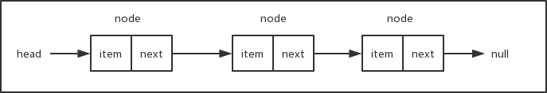

# 链表

## 数据结构
- 按存储结构划分为四种
   - 顺序存储
        - 存储空间一定连续
        - 按逻辑顺序存放
   - 链式存储
        - 线性结构
        - 非线性结构
   - 索引存储
   - 散列存储 
- 按元素之间前后关系划分为两种

    - 线性结构：有且只有一个根节点，且每个节点最多有一个直接前驱和一个直接后继的非空数据结构

    - 非线性结构：不满足线性结构的数据结构
    
## 链表
- 链表用来存储有序的元素集合，与数组不同，链表中的元素并非保存在连续的存储空间内，每个元素由一个存储元素本身的节点和一个指向下一个元素的指针构成。当要移动或删除元素时，只需要修改相应元素上的指针就可以了。对链表元素的操作要比对数组元素的操作效率更高。下面是链表数据结构的示意图：

