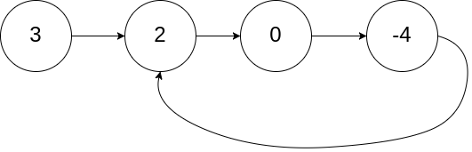

# 链表

## 数据结构
- 按存储结构划分为四种
   - 顺序存储
        - 存储空间一定连续
        - 按逻辑顺序存放
   - 链式存储
        - 线性结构
        - 非线性结构
   - 索引存储
   - 散列存储 
- 按元素之间前后关系划分为两种

    - 线性结构：有且只有一个根节点，且每个节点最多有一个直接前驱和一个直接后继的非空数据结构

    - 非线性结构：不满足线性结构的数据结构
    
## 链表
- 链表用来存储有序的元素集合，与数组不同，链表中的元素并非保存在连续的存储空间内，每个元素由一个存储元素本身的节点和一个指向下一个元素的指针构成。当要移动或删除元素时，只需要修改相应元素上的指针就可以了。对链表元素的操作要比对数组元素的操作效率更高。下面是链表数据结构的示意图：


## 环形链表

#### 题目
给你一个链表的头节点 head ，判断链表中是否有环。

如果链表中有某个节点，可以通过连续跟踪 next 指针再次到达，则链表中存在环。 为了表示给定链表中的环，评测系统内部使用整数 pos 来表示链表尾连接到链表中的位置（索引从 0 开始）。如果 pos 是 -1，则在该链表中没有环。注意：pos 不作为参数进行传递，仅仅是为了标识链表的实际情况。

如果链表中存在环，则返回 true 。 否则，返回 false 。


示例 1：



输入：head = [3,2,0,-4], pos = 1
输出：true
解释：链表中有一个环，其尾部连接到第二个节点。
示例2：


输入：head = [1,2], pos = 0
输出：true
解释：链表中有一个环，其尾部连接到第一个节点。

示例 3：


输入：head = [1], pos = -1
输出：false
解释：链表中没有环。


提示：

链表中节点的数目范围是 [0, 104]
-105 <= Node.val <= 105
pos 为 -1 或者链表中的一个 有效索引 。


进阶：你能用 O(1)（即，常量）内存解决此问题吗？

#### 解答

##### 快慢指针解法
-  解题思路： 定义两个指针，一个慢指针，一个快指针，并且一开始慢指针指向head节点，快指针指向head节点
- 然后，快指针每次向前移动两部，慢指针每次移动一步，开始遍历链表
    - 1、如果head或head.next为空 直接返回false
    - 2、定义两个指针pre,cur，并且初始化都指向head
    - 3、当cur不为空且cur.next不为空，pre每次向后移动一步，cur移动两步
    - 4、此时如果链表中有环，则pre 和cur会相等，如果没有环，会走到末尾返回false
 ```javascript
    var hasCycle = function(head) {
        if(!head || ! head.next ) return false
        let pre = head,cur = head;
        while (cur&&cur.next) {
           pre = pre.next
           cur = cur.next.next
           if(pre === cur) {
               return true
           }
        }
        return false
    };
```   
##### JSON.stringify简化实现
- JSON.stringify有环就要报错
```javascript
    var hasCycle = function(head) {
        try {
            JSON.stringify(head)
            return false
        } catch {
            return true
        }
    };
```
- 衍生出json环检查器
```javascript
/**
 * “环”检查器
 */
function detectorCircular(obj) {
    var hasCircle = false,            //  定义一个变量，标志是否有环
        cache = [];                   //  定义一个数组，来保存对象类型的属性值

    (function(obj) {
        var keys = Object.keys(obj);              //获取当前对象的属性数组
        for (var i = 0; i < keys.length; i++) {
            var key = keys[i];
            var value = obj[key];
            if (typeof value == 'object' && value !== null) {
                var index = cache.indexOf(value)
                if (index !== -1) {
                    hasCircle = true
                    break
                } else {
                    cache.push(value)
                    arguments.callee(value)
                    cache.pop()      //  注意：这里要推出数据，因为递归返回，后面遍历的属性不是这个数据的子属性
                }
            }
        }
    })(obj)

    return hasCircle
}
/**
   * JSON.stringify简化实现
   * @param obj 要转化为字符串的对象
   * @param ignoreCircular 是否忽略“环”检查
   */
  function stringify(obj,ignoreCircular) {
    if (!ignoreCircular && detectorCircular(obj)) {
      throw new TypeError('Converting circular structure to JSON')
    }
  
    const keys = Object.keys(obj)
    
    if (!keys.length) {
      return '{}'
    }
    
    const content = keys.map(key => {
      const value = obj[key]
      
      if (typeof value === 'number') {
        return `"${key}":${value}`
      } else {
        return `"${key}":${stringify(value, true)}`
      }
    }).join(',')
    
    return `{${content}}`
  }
  const obj = {
    foo: {
      name: 'foo'
    },
    bar: {
      name: 'bar',
      baz: {
        name: 'baz',
        next: null // 将指向obj.bar
      }
    }
  };
  obj.bar.baz.next = obj.bar
  stringify(obj)
```
#### map解法
- 使用map，一路next通过has…看有无重复
```javascript
    var hasCycle = function (head) {
        let dataMap = new Map()
        while (head) {
          if (dataMap.has(head)) {
            return true
          }
          dataMap.set(head, 1)
          head = head.next
        }
        return false
      };
```
